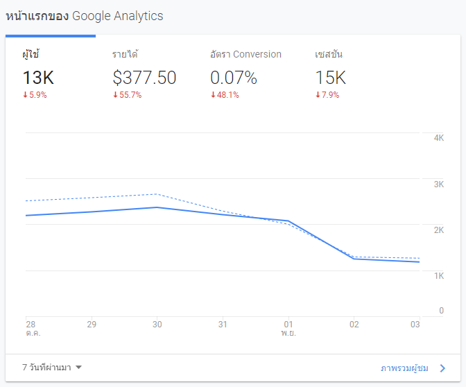
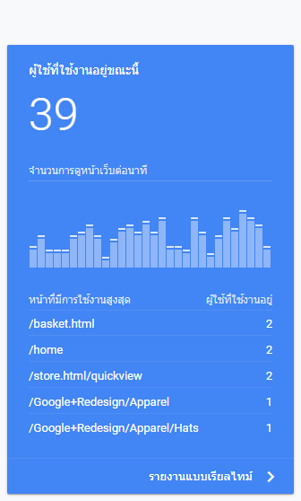
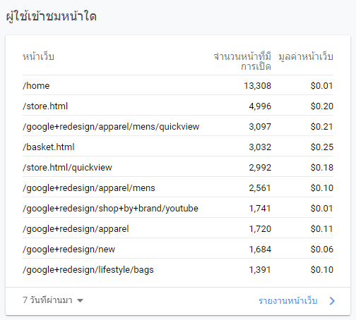
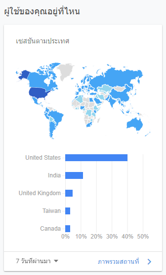
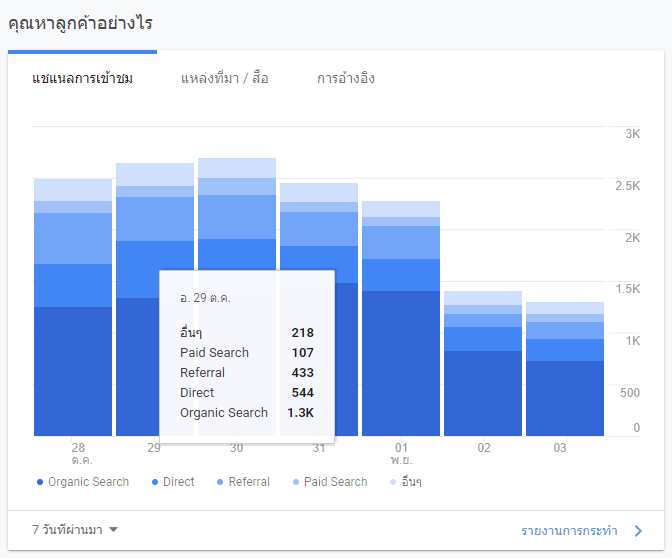
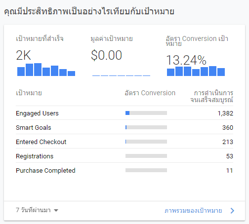
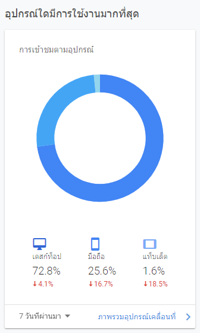

[Google Analytics](http://analytics.google.com/) คือเครื่องมือวิเคราะห์และวัดผลผู้เข้าชมเว็บไซต์ Google Analytics เป็นบริการฟรีจาก Google ที่เปิดให้เจ้าของเว็บไซต์นำรหัสติดตามไปติดตั้งเพื่อเก็บข้อมูลสถิติผู้เข้าชมเว็บไซต์ได้โดยตรง แล้วข้อมูลที่ เก็บมีอะไรบ้าง โดยวันนี้ผมจะมาสรุปข้อมูลเบื้องต้นที่เราสามารถเรียกดูว่ามีอะไรบ้าง

### Google Analytics ดูรายงานอะไรได้บ้าง

ตัวแดชบอร์ดของ Google Analytics มีหน้าภาพรวมเพื่อความเรียบง่ายในการดูรายงานของผู้ใช้งาน โดยผู้ใช้สามารถนำรายงานเหล่านี้มาปรับปรุงประสิทธิภาพของโฆษณาของ Google Ads หรือ ปรับปรุงประสิทธิภาพของเว็บไซต์ได้โดยอ้างอิงจากข้อมูลที่เกิดขึ้นจริง ซึ่งตัวข้อมูลหลักๆที่เราจะใช้ในการปรับปรุงประสิทธิภาพเพิ่มเติมมีดังนี้

ส่วนภาพรวมนี้เราสามารถดูจำนวนผู้ใช้ทั้งหมดที่เกิดขึ้นภายใน 7 วันที่ผ่านมา หรือ 30 วันที่ผ่านมาได้ โดยจะมีสรุปที่เป็นหัวข้อสำคัญอยู่ทั้งหมด 4 หัวข้อคือ ผู้ใช้, รายได้, อัตรา Conversion และ เซสชัน

*   ผู้ใช้ คือ จำนวนผู้เข้าใช้งานเว็บไซต์ในช่วงเวลาที่ผ่านมา จะมีการสรุปผู้ใช้กับข้อมูลในอดีตว่ามีผู้ใช้งานเพิ่มมากน้อยแค่ไหนเป็นเปอร์เซ็น
*   รายได้ คือ รายได้ที่เกิดขึ้นในรอบวันที่ผ่านมา การที่จะโชว์รายได้ในรายงานนี้ได้นั้น เว็บไซต์ของผู้ใช้งานจะต้องเป็นระบบ E-Commerce มีการซื้อขายและชำระเงินภายในเว็บไซต์ ้และต้องมีการตั้งค่า Analytics E-Commerce Tracking เสียก่อน
*   อัตรา Conversion คือ จำนวนอัตราการเกิด Conversion จากผู้เข้าชมเว็บไซต์ในช่วงเวลาที่ผ่านมา โดยคิดเป็นเปอร์เซ็น ผู้ใช้จะต้องมีการตั้งค่า Conversion ผ่านในบัญชี analytics เสียก่อน (Conversion คือเป้าหมายของการที่มีผู้เข้าชมเว็บไซต์ เช่น อยากให้ผู้เข้าชมเว็บไซต์สมัครสมาชิก หรือเพิ่มเพื่อนในไลน์ เป็นต้น) ซึ่งเราจะสามารถวัดผลของเว็บไซต์ว่ามีประสิทธิภาพได้ผ่านเมนูนี้
*   เซลชัน คือ จำนวนการเปิดหน้าเว็บไซต์จนไปถึงปิดหน้าเว็บไซต์ ซึ่งข้อมูลในส่วนตรงนี้จะมีเยอะกว่าจำนวน ผู้ใช้ เพราะ ผู้ใช้หนึ่งคนสามารถมีได้หลายเซลชัน ยกตัวอย่างเช่น นาย ก มีการเปิดเว็บไซต์ 2 เซลชัน ครั้งแรกมีการดูข้อมูลสินค้าภายในเว็บไซต์แต่ไม่เกิดการซื้อขายขึ้นและได้ปิดเว็บไซต์ไป ภายในช่วงเวลาต่อมา นาย ก มีการเปิดเว็บไซต์และทำการซื้อขายสินค้าขึ้นและปิดเว็บไซต์ไป

ผู้ใช้ที่ใช้งานอยู่ขณะนี้คือส่วนที่บอกจำนวนของผู้ใช้ที่ออนไลน์อยู่บนเว็บไซต์เราขณะนี้ ซึ่งจะสามารถดูพฤติกรรมของผู้ใช้งานแบบเรียลไทม์อย่างระเอียดได้ที่ส่วน รายงานแบบเรียลไทม์

ข้อมูลผู้เข้าชมเว็บหน้าใดนี้สามารถดูรายละเอียดหน้าที่มีการเปิดมากที่สุด ซึ่งประโยชน์ของการใช้ข้อมูลในส่วนนี้คือการที่เราจะรู้ว่าผู้ใช้มีการเปิดหน้าไหนมากที่สุดซึ่ง สามารถนำข้อมูลตรงนี้มาปรับหน้าเว็บไซต์ที่มีการเข้าชมมาที่สุดให้เป็นหน้าสำคัญที่ต้องการจะสื่อสารกับผู้เข้าใช้งานเข้าเว็บไซต์เรานั่นเอง

ผู้ใช้ของคุณอยู่ที่ไหน เป็นการรายงานข้อมูลเซสชันตามประเทศโดยสามารถสรุปประเทศของผู้เข้าใช้งานของเราโดยรวมได้

คุณหาลูกค้าอย่างไร ในส่วนนี้จะเป็นส่วนที่ค่อนข้างสำคัญสำหรับนักการตลาดออนไลน์เพราะจะสามารถวิเคราะห์แหล่งที่มาของผู้ใช้ได้อย่างละเอียดว่าแผนการตลาดช่องทางไหนมีประสิทธิภาพมากที่สุดโดยจะแบ่งออกเป็นหมวดหมู่หลักๆดังนี้

*   Direct คือ ผู้ใช้ที่มีการเข้ามาที่เว็บไซต์เราโดยตรงโดยการพิมพ์ url จากเว็บบราวเซอร์ เช่น http://webmeupdigital.com/
*   Paid Search คือ ผู้ใช้ที่มาจากโฆษณาช่องทางของ Google Ads (Search Campaign) เป็นตัวชี้วัดว่าโฆษณาของเรามีประสิทธิภาพมากแค่ไหน
*   Organic Search คือ ผู้ใช้ที่มาจากผลการค้นหา ตัวชี้วัดตัวนี้จะเอาไว้ชี้วัด SEO ว่ามีประสิทธิภาพมากแค่ไหน ซึ่งถ้าผู้ใช้มาจากช่องทางนี้เยอะ เราอาจจะไม่จำเป็นต้องทุ่มงบโฆษณาเยอะก็ได้
*   Social คือ ผู้ใช้ที่มาจากช่องทาง Social network เช่น Facebook, Twitter หรือ Instagram เป็นต้น
*   Referral คือ ผู้ใช้มาจากแหล่งอ้างอิงอื่นๆ อันนี้ผมขอยกตัวอย่างง่ายๆ เช่น มีการคลิกลิงค์ของเว็บไซต์จากเว็บไซต์อื่นๆ เช่น เว็บบอร์ด เป็นต้น

ประสิทธิภาพเป็นอย่างไรเทียบกับเป้าหมาย เมนูในส่วนนี้ทางผู้อ่านอาจจะต้องมีการกำหนดเป้าหมายของผู้ใช้ที่เข้ามาที่เว็บไซต์ของเราเสียก่อน ซึ่งเป้าหมายของแต่ละเว็บไซต์จะแตกต่างกันออกไป เช่น มีคนซื้อสินค้าภายในเว็บไซต์, มีคนสมัครสมาชิกหรือ มีการติดต่อเข้ามาเพื่อเป็นโอกาสในการขายของเรา เป็นต้น เมื่อมีเป้าหมายเรียบร้อยแล้ว เราสามารถวัดเป้าหมายของเว็บไซต์เราได้ว่าในผู้ใช้งานที่เข้ามาที่เว็บไซต์เรานั้นมีผู้ใช้ที่สำเร็จเป้าหมายเป็นจำนวนกี่คน และกี่เปอร์เซ็น หากเปอร์เซ็นน้อยกว่าที่คาดหวังเราสามารถแก้ไขหรือปรับปรุงตัวเว็บไซต์ให้มีการเกิดเป้าหมายที่ดีขึ้นได้

อุปกรณ์ใดมีการใช้งานมากที่สุด ในส่วนนี้ถือเป็นส่วนที่สำคัญมากอีกส่วนหนึ่ง เนื่องจากเราจะสามารถทราบอุปกรณ์ที่ผู้ใช้งานเข้ามาที่เว็บไซต์ของเรา และนำข้อมูลตรงนี้มาปรับปรุงเนื้อหาและดีไซน์ของเว็บไซต์ให้เป็นไปตามผู้ใช้งานส่วนมากเพื่อประสบการณ์ที่ดีของผู้ใช้งานของเว็บไซต์เรา และอัตราการสำเร็จของเป้าหมายที่มากขึ้น

บทความนี้อาจจะเป็นแค่เพียงขั้นต้นสำหรับการใช้งาน Google Analytics ซึ่งจริงๆแล้วเครื่องมือนี้สามารถใช้งานตั้งแต่ขั้นพื้นฐานไปจนถึงระดับมืออาชีพได้ ทางผมอาจจะมาอธิบายการใช้งานเพิ่มเติมในบทความถัดไป เนื่องจากเครื่องมือนี้มีวิธีการใช้งานที่ค่อนข้างหลากหลายมาก