Google Tag Manager คือเครื่องมือจัดการแท็กที่ทางกูเกิ้ลสร้างขึ้นมาเพื่อแก้ไขปัญหาของคนที่มีเว็บไซต์ และต้องการที่จะติดตั้งเครื่องมือเพิ่มเติม เช่น Google Analytics เพื่อที่จะเก็บสถิติผู้ใช้งานเว็บไซต์ของเรา, Facebook Pixel เพื่อขยายการโฆษณาในช่องทางของ Facebook หรือแม้กระทั้ง แท็ก Google Ads Re-marketing เพื่อเก็บกลุ่มเป้าหมายผู้เข้าชมเว็บไซต์ เครื่องมือเหล่านี้ล้วนที่จะต้องมีการติดตั้งโค้ดหรือรหัสติดตามลงในเว็บไซต์ของเรา ซึ่งจะทำให้เราต้องติดตามรหัสติดตามลงไปในเว็บไซต์หลายครั้ง ทำให้โค้ดที่ปรากฎในหลังบ้านค่อนข้างรกและมีการบริหารจัดการที่ยากลำบากเพราะว่าเราจะไม่รู้เลยว่ารหัสติดตามอยู่ที่ส่วนไหนบ้าง

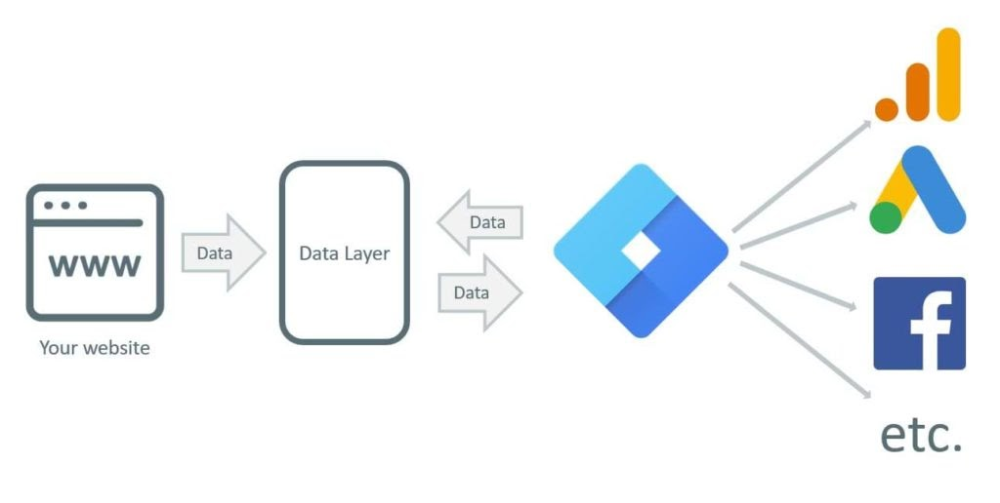

เครื่องมือ Google Tag Manager เลยมาเป็นพระเอกของเราในวันนี้ โดยหลักการทำงานของมันง่ายๆเลยคือเป็นตัวกลางที่ค่อนจัดการแท็กทุกอย่าง โดยเพียงแค่ติดตั้งโค้ด Google Tag Manager เข้าไปที่เว็บไซต์แค่ชุดเดียวและสามารถติดตั้งแท็กหรือโค้ดอื่นๆผ่าน Google Tag Manager ได้เลย ซึ่งข้อดีจะเห็นได้ชัดเลยว่าจะช่วยลดความรกของโค้ดที่อยู่ในเว็บไซต์ลง อีกทั้งยังสามารถจัดการแท็กต่างๆได้ผ่านทางอินเตอร์เฟซบนเว็บไซต์ [https://tagmanager.google.com/](https://tagmanager.google.com/) ได้เลย

ไม่เพียงแค่นั้นเครื่องมือ Google Tag Manager นี้ยังสามารถสร้างเงื่อนไขเพื่อตรวจจับเหตุการณ์ต่างๆของผู้ใช้ที่อยู่ภายในเว็บไซต์ได้ และนำข้อมูลเหล่านี้มาวิเคราะห์ผลเพื่อต่อยอดทางการตลาดได้อีกด้วย ยกตัวอย่างเช่น เก็บข้อมูล Call to Action ของผู้เข้าชมเว็บไซต์ที่มา กดปุ่มโทรศัพท์, แอดไลน์ หรือแม้กระทั่งกรอกแบบฟอร์ม เหตุการณ์เหล่านี้ล้วนถือเป็นโอกาสในการขายกับเรา ซึ่งเราจะรู้สถิติของการกระทำเหล่านี้และนำมาปรับปรุงแผนทางการตลาดในอนาคตได้อย่างถูกต้อง เช่น มีคนกดโทรเข้ามาค่อนข้างเยอะในช่วงเวลาหนึ่งทำให้สายซ้อนกันอาจจะเสียโอกาสในการขายไป อาจมีการเพิ่มเบอร์โทรศัพท์หรือพนักงานรับสายเข้ามาเพิ่มเติม หรือ หากมีคนกดปุ่มแอดไลน์เข้ามาเยอะ รายชื่อผู้ติดตามในไลน์เยอะพอสมควร เราสามารถทำช่องทางการตลาดออนไลน์ทางไลน์ได้ โดนการบรอดแคสข้อความ เป็นต้น

Google Tag Manager วิธีการสร้างบัญชี และติดตั้ง
-----------------------------------------------

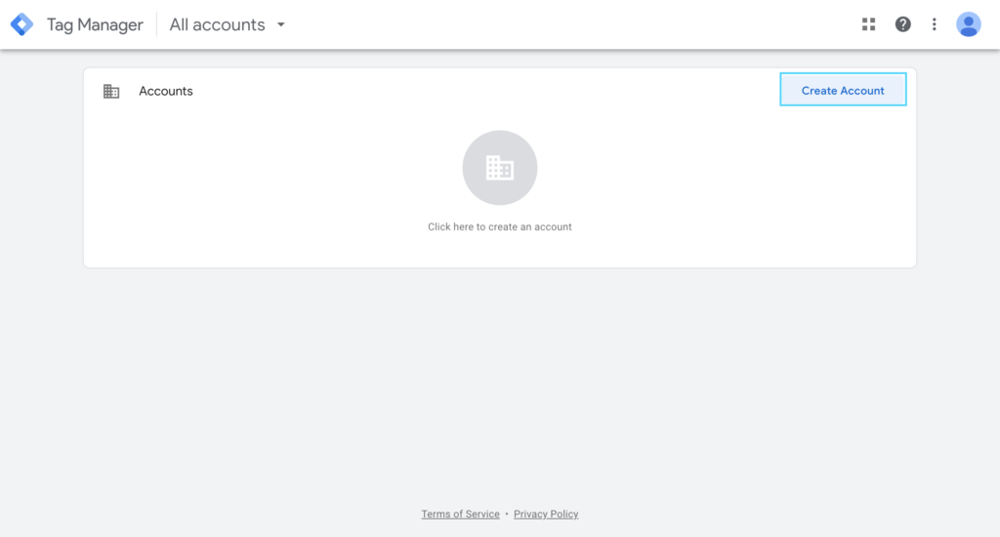

ขั้นตอนแรกเลยให้เข้าไปที่เว็บไซต์ [https://tagmanager.google.com/](https://tagmanager.google.com/) เมื่อเข้าไปที่เว็บไซต์เรียบร้อยแล้วจะสังเกตเห็นรูปแบบอินเตอร์เฟซตามรูปภาพด้านบน ต่อไปให้ทำการกดคลิกไปที่ปุ่ม “Create Account” หลังจากนั้นเว็บไซต์จะนำคุณไปสู่หน้าถัดไปเพื่อทำการสร้างบัญชี

ในขั้นตอนนี้ให้ทำการกรอกข้อมูลดังนี้

*   Account name (ชื่อบัญชี) เป็นชื่อบัญชีของเรา สามารถกรอกอะไรก็ได้ ซึ่งในหนึ่งบัญชีเราสามารถมีได้หลายคอนเทนเนอร์ ยกตัวอย่างเช่น บัญชีหนึ่งมีคอนเทนเนอร์สำหรับ เว็บไซต์ และแอพพลิเคชั่นสำหรับแอนดรอย์ เป็นต้น
*   Country (ประเทศ) ให้เลือกเป็นประเทศไทย
*   Container name (ชื่อคอนเทนเนอร์) ตรงนี้ให้ทำการกรอกชื่อเว็บไซต์ที่เราต้องการจะติดตั้งแท็กนี้
*   Target platform (แพลตฟอร์มเป้าหมาย) ให้เลือกเป็นเว็บไซต์ เนื่องจากโครงสร้างของคอนเทนเนอร์สำหรับเว็บไซต์จะไม่เหมือนกับแพลตฟอร์มอื่นๆ

เมื่อทำการกรอกเรียบร้อยแล้วสามารถกดที่ปุ่ม “Create” เพื่อทำการสร้างบัญชีได้เลย หลังจากนั้นเว็บไซต์จะปรากฎหน้าต่างให้เรายอมรับบริการข้อตกลง สามารถกดปุ่ม “Yes” เพื่อทำการยอมรับได้เลย

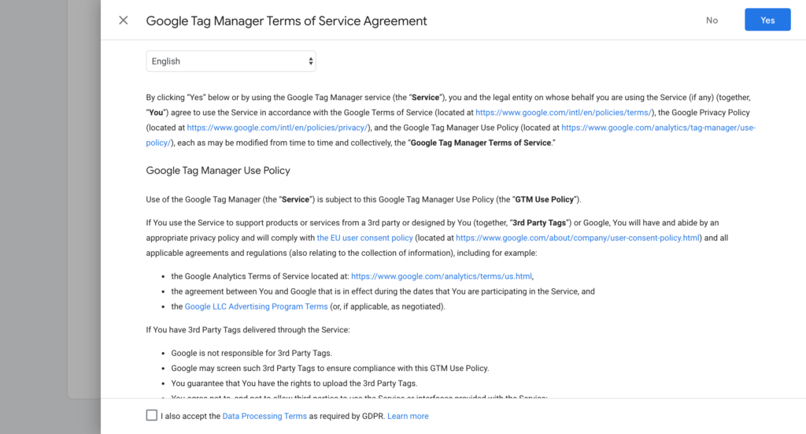

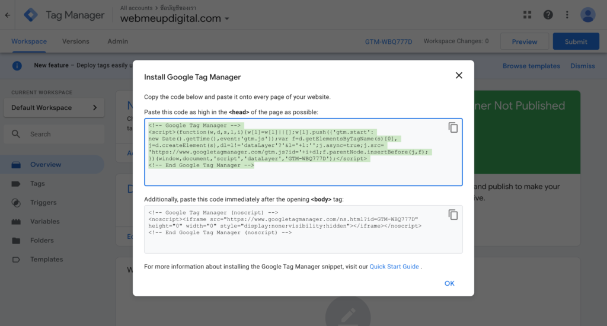

### หากติดตั้งเรียบร้อยแล้วจะรู้ได้อย่างไรว่าโค้ดของเราทำงานถูกต้อง ?

กูเกิ้ลได้สร้างส่วนขยายของ Google Chrome ขึ้นมาตัวหนึ่งเพื่อเป็นเครื่องมือเอาไว้ตรวจเช็คว่า มีแท็กตัวไหนของกูเกิ้ลติดตั้งอยู่บนเว็บไซต์บ้าง ตัวส่วนขยายตัวนี้มีชื่อว่า [Google Tag Assistant](https://chrome.google.com/webstore/detail/tag-assistant-by-google/kejbdjndbnbjgmefkgdddjlbokphdefk?hl=en) โดยเมื่อดาวน์โหลดและทำการติดตั้งเรียบร้อยแล้ว ให้เราเข้าไปที่เว็บไซต์ของเราและทำการคลิกที่ตัวส่วนขยาย Google Tag Assistant ตัวส่วนขยายจะมีการรายงานกับเราว่าพบเจอแท็กตัวไหนของกูเกิ้ลที่อยู่บนเว็บไซต์นี้บ้าง ซึ่งจากรูปภาพด้านล่างนี้ ส่วนขยายมีการมองเห็นบัญชี Google Analytics ที่หมายเลข 1. และบัญชี Google Tag Manager ที่หมายเลข 2. หากชื่อบัญชีที่ขึ้นต้นด้วย GTM-XXXXXXX ตรงกับบัญชีของเราแสดงว่ามีการติดตั้งที่ถูกต้อง

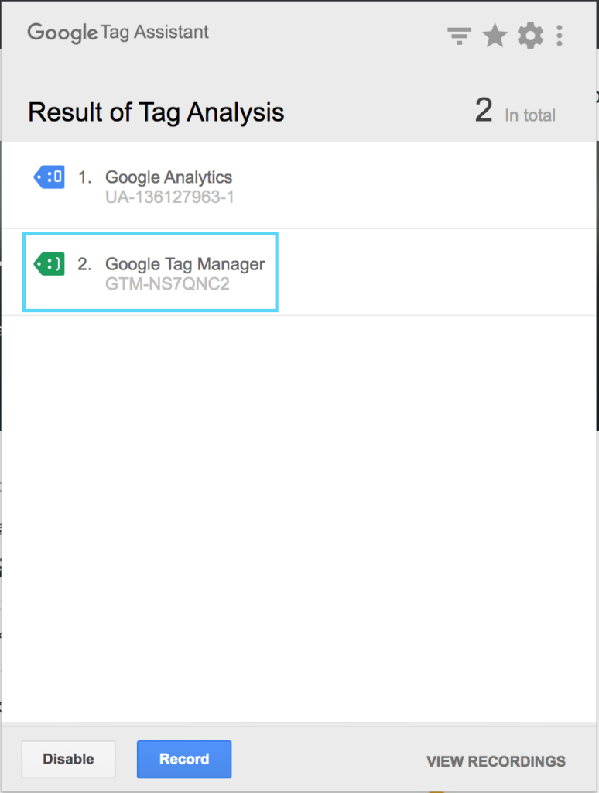

ติดตั้ง Google Analytics ผ่าน Google Tag Manager
------------------------------------------------

วิธีการติดตั้ง Google Analytics ผ่าน Google Tag Manager สำหรับผู้ที่เข้ามาอ่านและยังไม่รู้ว่า Google Analytics และ Google Tag Manager คืออะไรสามารถเข้าไปอ่านบทความด้านล่างนี้ได้เลย

*   [รู้จักกับ Google Analytics](http://purich.co/google-analytics/)

โดยเงื่อนไขของการติดตั้งครั้งนี้ทางผู้อ่านจะต้องเตรียมตัวดังนี้

1.  มีบัญชีของ Google Analytics
2.  มีบัญชีของ Google Tag Manager
3.  มีการติดตั้งรหัสติดตาม Google Tag Manager ไว้ที่เว็บไซต์เรียบร้อยแล้ว

โดยขั้นตอนแรกเลยให้ไปที่เว็บไซต์ [https://tagmanager.google.com/](https://tagmanager.google.com/) หลังจากนั้นให้กดเข้าไปที่บัญชีเว็บไซต์ของเรา จะพบกับเว็บไซต์ดังรูปด้านล่างนี้ ให้กดไปที่ “New Tag” เพื่อทำการติดตั้งแท็กตัวใหม่

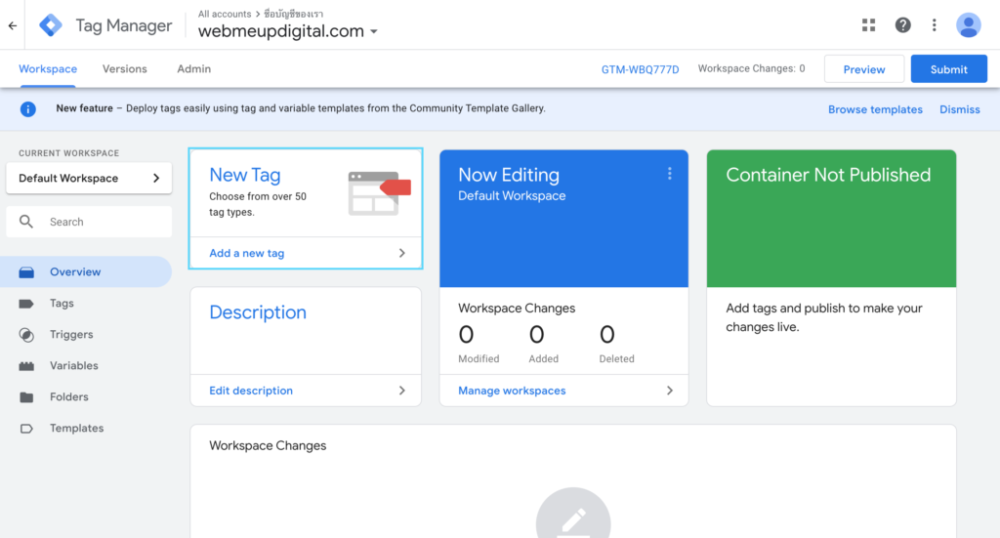
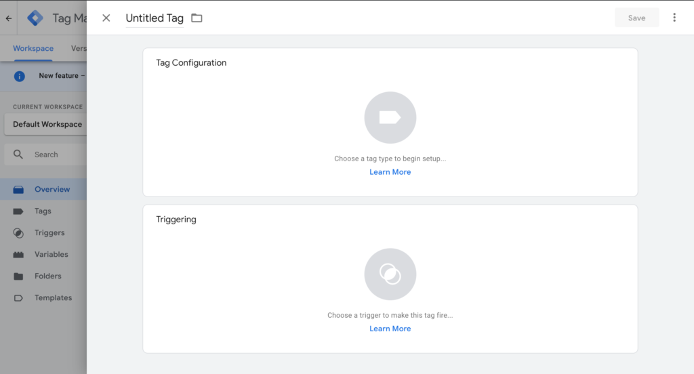

แท็กของ Google Tag Manager จะมีองค์ประกอบทั้งหมด 2 ส่วนคือ

*   Tag Configuration – การตั้งค่าแท็ก เป็นส่วนที่เอาไว้ใส่ข้อมูลและการตั้งค่าของแท็กว่าตัวนี้เป็นแท็กอะไร สามารถทำอะไรได้บ้าง
*   Triggering – ส่วนกำหนดเงื่อนไขการทำงานของแท็ก เช่น จะให้แท็กตัวนี้ทำงานในทุกหน้าของเว็บไซต์ หรือ จะให้แท็กตัวนี้ทำงานก็ต่อเมื่อมีการคลิกปุ่มเบอร์โทรศัพท์ที่อยู่ในเว็บไซต์ เป็นต้น

ซึ่งขั้นตอนแรกเราจะมาตั้งค่าแท็กสำหรับ Google Analytics กันเสียก่อน โดยให้ทำการคลิกไปที่ ไอคอนกลมๆสีเทาได้บนส่วนของ Tag Configuration เมื่อคลิกเรียบร้อยเว็บไซต์จะโชว์แท็กที่สามารถติดตั้งได้ทั้งหมดออกมาในเมนูด้านขวาตามรูปภาพด้านล่างนี้ ให้เราเลือกเป็น “Google Analytics: Universal Analytics” ด้านบนสุดเพื่อทำการติดตั้งแท็ก Google Analytics

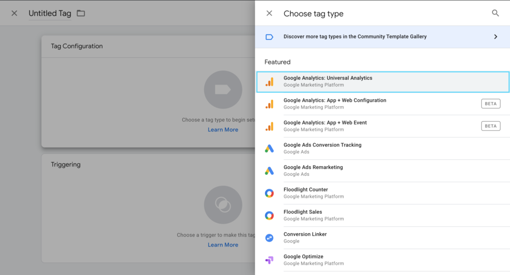

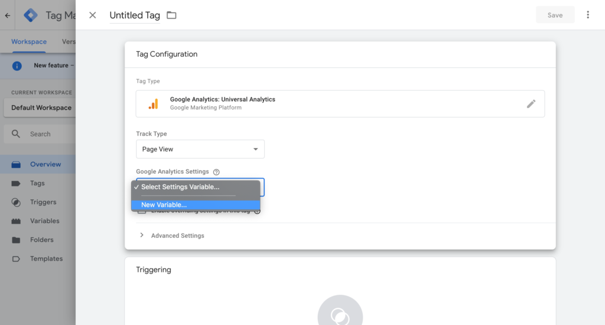

แท็ก Google Analytics: Universal Analytics จะมีประเภทของการทำงาน(Track Type) อยู่ด้วยกันหลายอันเลยคือ 1.Page View 2.Event 3.Transaction 4.Social 5.Timing 6.Decorate Link 7.Decorate Form แต่จริงๆแล้วจะมีการใช้งานหลักเลยแค่ 3 อันคือ 1.Page View ใช้สำหรับเก็บสถิติผู้เข้าชมเว็บไซต์ที่เข้ามาเยี่ยมชมเว็บไซต์ของเรา 2.Event เก็บเหตุการณ์ของผู้เข้าเว็บไซต์ของเรา เช่นมีการคลิกปุ่มแอดไลน์ หรือกรอกแบบฟอร์มเป็นต้น 3. Transaction บันทึกการทำธุรกิจกรรมของผู้ใช้ในเว็บไซต์เพื่อส่งไปให้ Google analytics เก็บข้อมูลโดยในวันนี้เราจะเลือกแค่ Page View เพราะเป็นแค่การติดตั้งเพื่อเก็บสถิติผู้เข้าชมเว็บไซต์พื้นฐาน หลังจากนั้นระบบจะให้เราเลือก Google Analytics Settings ซึ่งเป็นรหัสติดตามของ Google analytics เราที่ต้องการให้ Google Tag Manager ส่งข้อมูลไป โดยสามารถเข้าไปดูรหัสติดตามของเราได้ตามรูปภาพด้านล่างนี้ โดยรหัสติดตามจะขึ้นต้นด้วย UA-XXXXXXXX-X ให้เราคัดลอกยัง Google Tag Manager และกดไปที่ “New Variable” เพื่อทำการเพิ่มรหัสติดตามของเราไปเป็นตัวแปร

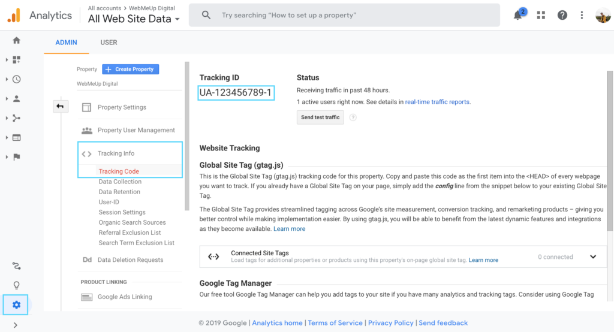

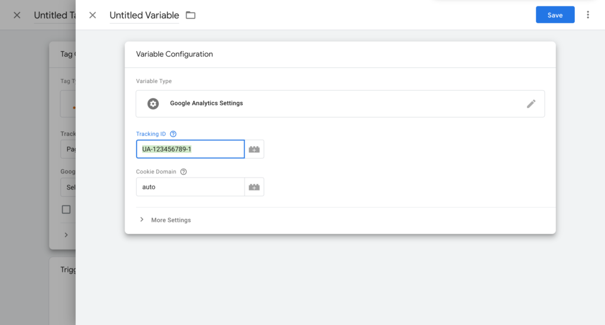

เมื่อกรอกรหัสติดตามเสร็จเรียบร้อยแล้ว สามารถกดปุ่ม “Save” ที่อยู่ด้านขวามือบนสีนำ้เงินได้เลย หลังจากนั้น ในส่วนของ Triggering ให้เราคลิกไปที่ไอคอนกลมๆสีเทา จะปรากฎหน้าต่างที่ให้เลือกเงื่อนไขการทำงานของแท็กขึ้น ในขั้นตอนนี้ให้เราเลือก All pages ตามรูปด้านล่างนี้เพื่อให้ตัวแท็ก Google Analytics สามารถทำงานทันทีเมื่อมีการเรียกหน้าเว็บไซต์ในทุกหน้า

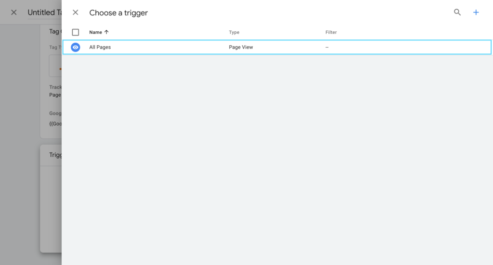

เมื่อทำการเลือก Triggering เรียบร้อยแล้วให้เรากดปุ่ม “Save” สีนำ้เงินด้านขวามือบน เพื่อทำการบันทึกการตั้งค่าของแท็ก Google Analytics เมื่อเสร็จเรียบร้อยแล้ว ให้ทำการกดปุ่ม “Submit” ด้านขวามือบนสีนำ้เงินเพื่อนำการตั้งค่านี้ไปใช้งานจริง แต่หากเราต้องการที่จะทดสอบก่อนว่าแท็กนี้มีการทำงานที่ถูกต้องหรือไม่ สามารถกดไปที่ปุ่ม “Preview” ด้านขวามือบนเพื่อเปิด โหมดทดสอบก่อนได้ โดยเมื่อเปิดโหมดทดสอบแล้ว หน้า Google Tag Manager ของเราจะปรากฎเป็นกล่องสีส้มขึ้นมาเพื่อบอกว่ามีการเปิดโหมดทดสอบขึ้นนะ

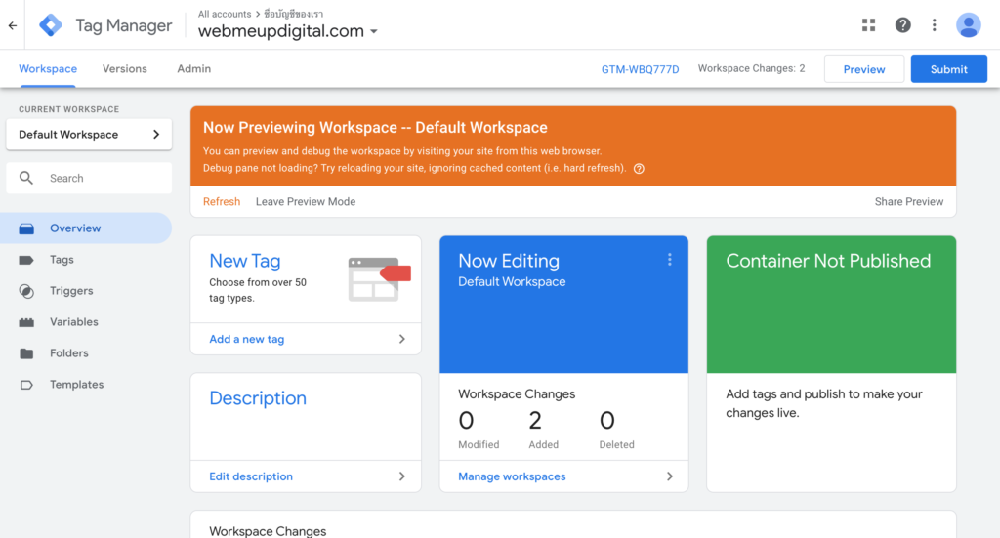

เมื่อเปิดโหมดทดสอบเรียบร้อยแล้ว หากลองไปที่หน้าเว็บไซต์จะสังเกตเห็นว่าจะมีกล่องแสดงตัวอย่างของ Google Tag Manager ปรากฎอยู่ที่ด้านล่างของเว็บไซต์เรา ซึ่งตรงนี้เราจะมองเห็นแค่คนเดียวผู้เยี่ยมชมเว็บไซต์คนอื่นจะไม่สามารถมองเห็นได้ ที่โหมดทดสอบจะสังเกตเห็นว่าแท็ก Google Analytics – Universal Analytics (กล่องสีขาว) อยู่ในส่วนที่เขียนว่า Tags Fired On This Page แสดงว่าแท็ก Google Analytics ของเรามีการทำงานที่ถูกต้องและเก็บข้อมูลผู้ใช้เรียบร้อยแล้ว หากไม่แน่ใจสามารถเช็คที่บัญชีของ Analytics อีกครั้งได้ว่ามีผู้ใช้ออนไลน์อยู่ที่หน้าเว็บไซต์เราหรือไม่

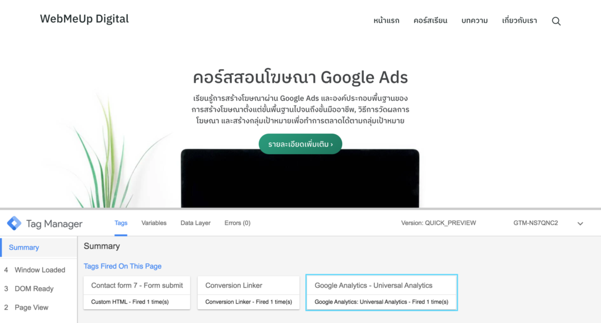

เมื่อทำการทดสอบเรียบร้อยแล้วผู้ใช้งานสามารถออกจากโหมดทดสอบได้ที่หน้าต่างของ Google Tag Manager โดยคลิกที่ปุ่ม “Leave Preview Mode” หรือ “ออกจากโหมดแสดงตัวอย่าง” ได้ที่ด้านล่างของกล่องสีส้ม

การใช้งาน Google Tag Manager ค่อนข้างซับซ้อนนิดนึง แต่หากเราเริ่มที่จะรู้จักมันดีหรือเข้าใจวิธีการทำงานของมันแล้ว เครื่องมือนี้จะสามารถช่วยต่อยอดทางการตลาดของเราได้อย่างไม่รู้จบเลย ในบทความถัดไปทางทีมงานจะมาบอกวิธีการติดตั้งเครื่องมือวัด Conversion ใน Google Ads(Google Ads Conversion Tracking) ผ่าน Google Tag Manager กันครับ